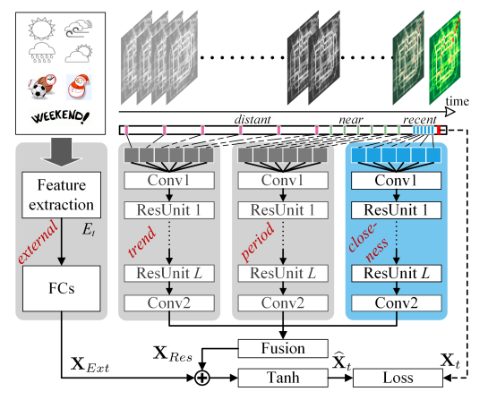

# UPDATE:
The code only implements the STResNet architecture and doesn't aim to reproduce the results on the datasets of the original paper.

-----

# ST-ResNet in Tensorflow

A TensorFlow implementation of Deep Spatio-Temporal Residual Networks (ST-ResNet) from the paper ["Deep Spatio-Temporal Residual Networks for Citywide Crowd Flows Prediction"](https://arxiv.org/abs/1610.00081). ST-ResNet is an end-to-end deep learning model which uses the unique properties of temporal closeness, period and trend of spatio-temporal data, to forecast the in-flow and out-flow of crowds in a city region.

## Model architecture

 

## Prerequisites

* Python 2.7
* Tensorflow 1.8
* NumPy 1.14.2

## Usage

To create the TensorFlow computation graph of the ST-ResNet architecture run:

    $ python main.py

## Code Organization

The model is implemented using OOPs and extensive modularity.

File structure:

* `main.py`: This file contains the main program. The computation graph for ST-ResNet is built, launched in a session and trained here.
* `params.py`: This file contains class Params for hyperparameter declarations.
* `modules.py`: This file contain helper functions and custom neural layers written in a modular style. An OOP paradigm is used to define the computation graph in st_resnet.py. These functions help in abstracting the complexity of the architecture from the main st_resnet.py as well as Tensorflow features (e.g. sharing of weights across network blocks). Therefore the computation graph can be defined as a simple outline (major blocks) in st_resnet.py with the actual heavy lifting outsourced as function calls here.
* `st_resnet.py`: This file defines the Tensorflow computation graph for the ST-ResNet (Deep Spatio-temporal Residual Networks) architecture written in an OOP and modular manner. The outline of the architecture from inputs to outputs in defined here using calls to functions defined in modules.py to handle the inner complexity. Modularity ensures that the working of a component can be easily modified in modules.py without changing the skeleton of the ST-ResNet architecture defined in this file.

## Reference

Zhang, Junbo, Yu Zheng, and Dekang Qi. "Deep Spatio-Temporal Residual Networks for Citywide Crowd Flows Prediction." AAAI. 2017. [https://arxiv.org/pdf/1610.00081.pdf](https://arxiv.org/pdf/1610.00081.pdf)
